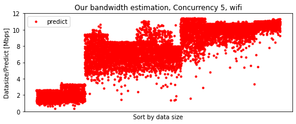

```python
import numpy as np
import matplotlib.pyplot as plt
from scipy import stats
from sklearn.metrics import mean_absolute_error
cons =  [0,5,10,15,20,30,40,50,60]

from sklearn.metrics import r2_score
def MAPE(y_test, y_pred):
    return np.mean(np.abs((y_test - y_pred) / y_test)) * 100

temp4 = []
temp5 = []

for con in cons:
    data = np.loadtxt( "data/wifitest_con{}.csv".format(con), delimiter=",", skiprows=1)
    data = data[data[:, 1].argsort()]
    
    fig, ax = plt.subplots(figsize=(7,3))
    plt.plot(data[:,1])
    ax.set_title("B0")
    ax.set_ylabel("Data size [Byte]")

    ax.axes.xaxis.set_ticks([])
    ############################################################

    fig, ax = plt.subplots(figsize=(7,3))

    ax.plot(data[:,4], "g.", label = "ground truth",zorder=10)
    ax.plot(data[:,7] + (data[:,9]/2), "r.", alpha=0.3, label = "predict",zorder=5)
    mae = mean_absolute_error(data[:,4], data[:,7])
    ax.set_title("Concurrency {}, wifi, mae: {:.3f}".format(con, mae))
    ax.set_ylabel("Time [ms]")

    ax.axes.xaxis.set_ticks([])
    ax.set_xlabel("Sort by data size")
    ax.set_ylim(0,100)

    ax.legend()
    fig.tight_layout()
    plt.savefig("fig/predict{}.png".format(con), bbox_inches="tight")

    ############################################################
    fig, ax = plt.subplots(figsize=(7,3))

    ax.plot(data[:,4], "g.", label = "ground truth",zorder=10)
    ax.plot(data[:,8], "y.", alpha=0.3, label = "naive",zorder=5)
    mae = mean_absolute_error(data[:,4], data[:,8])
    ax.set_title("Concurrency {}, wifi, mae: {:.3f}".format(con, mae))
    ax.set_ylabel("Time [ms]")
    ax.axes.xaxis.set_visible(False)
    ax.set_ylim(0,100)
    ax.axes.xaxis.set_ticks([])
    ax.set_xlabel("Sort by data size")
    ax.legend()
    fig.tight_layout()
    plt.savefig("fig/naive{}.png".format(con), bbox_inches="tight")
    ############################################################

    fig, ax = plt.subplots(figsize=(7, 3))

    points = list(set(data[:, 1]))
    print(points)
    points.sort()

    temp = []
    temp2 = []

    for p in points:
        point_data = data[np.where(data[:, 1] == p)]
        temp.append(mean_absolute_error(point_data[:, 4],point_data[:, 7]))
        
        temp2.append(mean_absolute_error(point_data[:, 4], point_data[:, 8]))
    temp5.append(temp)

    ax.plot(temp, "r", label="predict")
    ax.plot(temp2, "y", label="naive")
    ax.set_ylabel("MAE [ms]")
    ax.set_xlabel("data size")
    ax.legend()
    ax.set_title("MAE between [our/naive] estimation and ground truth, Concurrency {}, wifi".format(con))
    ax.set_ylim(0,300)

    plt.savefig("fig/mae_{}.png".format(con), bbox_inches="tight")

    ############################################################

    points = list(set(data[:, 1]))
    print(points)
    points.sort()

    temp3 = []

    for p in points:
        point_data = data[np.where(data[:, 1] == p)]
        temp3.append(np.mean(point_data[:, 4]))
    print("t", temp3)
    temp4.append(temp3)

    ############################################

    fig, ax = plt.subplots(figsize=(7,3))

    ax.plot(((1000*data[:,1])/data[:,4])/1000/1000, "g.", label = "ground truth",zorder=10)
    pearsonr = stats.pearsonr(data[:,4], data[:,8])
    ax.set_title("Ground truth bandwidth, Concurrency {}, wifi".format(con))
    ax.set_ylabel("Datasize/GT [Mbps]")
    ax.axes.xaxis.set_ticks([])
    ax.set_xlabel("Sort by data size")
    ax.legend()
    fig.tight_layout()
    ax.set_ylim(0,12)
    plt.savefig("fig/gt_bw{}.png".format(con), bbox_inches="tight")

    fig, ax = plt.subplots(figsize=(7,3))
    ax.plot(((1000*data[:,1])/data[:,7])/1000/1000, "r.", label = "predict",zorder=10)
    ax.set_title("Our bandwidth estimation, Concurrency {}, wifi".format(con))
    ax.set_ylabel("Datasize/Predict [Mbps]")
    ax.axes.xaxis.set_ticks([])
    ax.set_xlabel("Sort by data size")
    ax.legend()
    fig.tight_layout()
    ax.set_ylim(0,12)

    plt.savefig("fig/predict_bw{}.png".format(con), bbox_inches="tight")

    fig, ax = plt.subplots(figsize=(7,3))
    ax.plot(((1000*data[:,1])/(data[:,8]+(data[:,9]/2)/1000))/1000/1000, "y.", label = "naive",zorder=10)
    ax.set_title("naive bandwidth estimation, Concurrency {}, wifi".format(con))
    ax.set_ylabel("Datasize/Naive [Mbps]")
    ax.axes.xaxis.set_ticks([])
    ax.set_xlabel("Sort by data size")
    ax.legend()
    fig.tight_layout()
    ax.set_ylim(0,12)

    plt.savefig("fig/naive_bw{}.png".format(con), bbox_inches="tight")

    plt.show()

fig, ax = plt.subplots(figsize=(7,3))
print("t2", temp4)
for i,t in enumerate(temp4):
    ax.plot(t, label="predict {}".format(i))
ax.set_ylabel("comm time [ms]")
ax.set_xlabel("data size")
ax.legend()
ax.set_title("Average communication time for each point (sorted by datasize)".format(con))
plt.savefig("fig/commtime_{}.png".format(con), bbox_inches="tight")

fig, ax = plt.subplots(figsize=(7,3))
print("t2", temp4)
for i,t in enumerate(temp5):
    ax.plot(t, label="predict simultaneous load {}".format(i))
ax.set_ylabel("MAE between communication estimation and ground truth")
ax.set_xlabel("partitioning points sorted by data size (small to large)")
ax.legend()
ax.set_title("MAE, wifi")
plt.savefig("fig/con_mae.png", bbox_inches="tight")
plt.show()

```

    [4000.0, 5120.0, 37632.0, 62720.0, 87808.0, 125440.0, 250880.0, 301056.0, 602112.0]
    [4000.0, 5120.0, 37632.0, 62720.0, 87808.0, 125440.0, 250880.0, 301056.0, 602112.0]
    t [5.589901869158878, 5.777010405679514, 9.556864465811964, 12.572917524752476, 15.231026584867076, 18.103920292887025, 30.331299808795407, 35.791273388773384, 61.671753065134105]
    


    [4000.0, 5120.0, 37632.0, 62720.0, 87808.0, 125440.0, 250880.0, 301056.0, 602112.0]
    [4000.0, 5120.0, 37632.0, 62720.0, 87808.0, 125440.0, 250880.0, 301056.0, 602112.0]
    t [5.873078071065991, 5.9867542857142855, 9.716179293248945, 12.385502156469409, 14.534965113974232, 17.7018126746507, 29.24828856868396, 34.0477337755102, 60.34261120607787]
    





    [4000.0, 5120.0, 37632.0, 62720.0, 87808.0, 125440.0, 250880.0, 301056.0, 602112.0]
    [4000.0, 5120.0, 37632.0, 62720.0, 87808.0, 125440.0, 250880.0, 301056.0, 602112.0]
    t [6.1858315736040606, 6.374139007092198, 10.292107932489452, 12.534936609829488, 14.859147175421208, 18.039212674650702, 30.027600960614794, 34.33933775510203, 61.652687654320985]
    


    [4000.0, 5120.0, 37632.0, 62720.0, 87808.0, 125440.0, 250880.0, 301056.0, 602112.0]
    [4000.0, 5120.0, 37632.0, 62720.0, 87808.0, 125440.0, 250880.0, 301056.0, 602112.0]
    t [6.265697553299493, 6.3222068591692, 10.33519194092827, 12.51944784353059, 15.262556491575818, 18.4348126746507, 29.906395389048992, 34.585368367346945, 61.024194871794876]
    


    [4000.0, 5120.0, 37632.0, 62720.0, 87808.0, 125440.0, 250880.0, 301056.0, 602112.0]
    [4000.0, 5120.0, 37632.0, 62720.0, 87808.0, 125440.0, 250880.0, 301056.0, 602112.0]
    t [6.315028690355329, 6.342849746707194, 10.221740601265823, 12.93874588766299, 15.46203171456888, 18.507312075848304, 30.04474783861671, 34.58505183673469, 61.38032801519468]
    


    [4000.0, 5120.0, 37632.0, 62720.0, 87808.0, 125440.0, 250880.0, 301056.0, 602112.0]
    [4000.0, 5120.0, 37632.0, 62720.0, 87808.0, 125440.0, 250880.0, 301056.0, 602112.0]
    t [7.022302037383177, 6.864579229208924, 10.985194893162394, 13.694999009900991, 15.7252427402863, 19.66170815899582, 31.451288336520076, 35.63719667359667, 64.10367298850575]
    


    [4000.0, 5120.0, 37632.0, 62720.0, 87808.0, 125440.0, 250880.0, 301056.0, 602112.0]
    [4000.0, 5120.0, 37632.0, 62720.0, 87808.0, 125440.0, 250880.0, 301056.0, 602112.0]
    t [6.638216317757009, 6.917666470588235, 10.796489999999999, 13.130363168316832, 15.489541922290389, 18.739766945606693, 30.65278776290631, 34.65239792099793, 61.30025268199233]
    


    [4000.0, 5120.0, 37632.0, 62720.0, 87808.0, 125440.0, 250880.0, 301056.0, 602112.0]
    [4000.0, 5120.0, 37632.0, 62720.0, 87808.0, 125440.0, 250880.0, 301056.0, 602112.0]
    t [8.195606411214953, 8.468031237322515, 12.028959636752136, 14.674406435643563, 17.167691002044993, 20.40374372384937, 32.78087399617591, 37.29509064449065, 63.93750785440613]
    


    [4000.0, 5120.0, 37632.0, 62720.0, 87808.0, 125440.0, 250880.0, 301056.0, 602112.0]
    [4000.0, 5120.0, 37632.0, 62720.0, 87808.0, 125440.0, 250880.0, 301056.0, 602112.0]
    t [8.969494373831777, 9.347038803245436, 12.961798076923076, 15.488929702970296, 17.131937832310836, 20.869566317991634, 34.55935487571702, 36.82560083160084, 65.35550268199235]
    


    t2 [[5.589901869158878, 5.777010405679514, 9.556864465811964, 12.572917524752476, 15.231026584867076, 18.103920292887025, 30.331299808795407, 35.791273388773384, 61.671753065134105], [5.873078071065991, 5.9867542857142855, 9.716179293248945, 12.385502156469409, 14.534965113974232, 17.7018126746507, 29.24828856868396, 34.0477337755102, 60.34261120607787], [6.1858315736040606, 6.374139007092198, 10.292107932489452, 12.534936609829488, 14.859147175421208, 18.039212674650702, 30.027600960614794, 34.33933775510203, 61.652687654320985], [6.265697553299493, 6.3222068591692, 10.33519194092827, 12.51944784353059, 15.262556491575818, 18.4348126746507, 29.906395389048992, 34.585368367346945, 61.024194871794876], [6.315028690355329, 6.342849746707194, 10.221740601265823, 12.93874588766299, 15.46203171456888, 18.507312075848304, 30.04474783861671, 34.58505183673469, 61.38032801519468], [7.022302037383177, 6.864579229208924, 10.985194893162394, 13.694999009900991, 15.7252427402863, 19.66170815899582, 31.451288336520076, 35.63719667359667, 64.10367298850575], [6.638216317757009, 6.917666470588235, 10.796489999999999, 13.130363168316832, 15.489541922290389, 18.739766945606693, 30.65278776290631, 34.65239792099793, 61.30025268199233], [8.195606411214953, 8.468031237322515, 12.028959636752136, 14.674406435643563, 17.167691002044993, 20.40374372384937, 32.78087399617591, 37.29509064449065, 63.93750785440613], [8.969494373831777, 9.347038803245436, 12.961798076923076, 15.488929702970296, 17.131937832310836, 20.869566317991634, 34.55935487571702, 36.82560083160084, 65.35550268199235]]
    t2 [[5.589901869158878, 5.777010405679514, 9.556864465811964, 12.572917524752476, 15.231026584867076, 18.103920292887025, 30.331299808795407, 35.791273388773384, 61.671753065134105], [5.873078071065991, 5.9867542857142855, 9.716179293248945, 12.385502156469409, 14.534965113974232, 17.7018126746507, 29.24828856868396, 34.0477337755102, 60.34261120607787], [6.1858315736040606, 6.374139007092198, 10.292107932489452, 12.534936609829488, 14.859147175421208, 18.039212674650702, 30.027600960614794, 34.33933775510203, 61.652687654320985], [6.265697553299493, 6.3222068591692, 10.33519194092827, 12.51944784353059, 15.262556491575818, 18.4348126746507, 29.906395389048992, 34.585368367346945, 61.024194871794876], [6.315028690355329, 6.342849746707194, 10.221740601265823, 12.93874588766299, 15.46203171456888, 18.507312075848304, 30.04474783861671, 34.58505183673469, 61.38032801519468], [7.022302037383177, 6.864579229208924, 10.985194893162394, 13.694999009900991, 15.7252427402863, 19.66170815899582, 31.451288336520076, 35.63719667359667, 64.10367298850575], [6.638216317757009, 6.917666470588235, 10.796489999999999, 13.130363168316832, 15.489541922290389, 18.739766945606693, 30.65278776290631, 34.65239792099793, 61.30025268199233], [8.195606411214953, 8.468031237322515, 12.028959636752136, 14.674406435643563, 17.167691002044993, 20.40374372384937, 32.78087399617591, 37.29509064449065, 63.93750785440613], [8.969494373831777, 9.347038803245436, 12.961798076923076, 15.488929702970296, 17.131937832310836, 20.869566317991634, 34.55935487571702, 36.82560083160084, 65.35550268199235]]
    


```python

```
